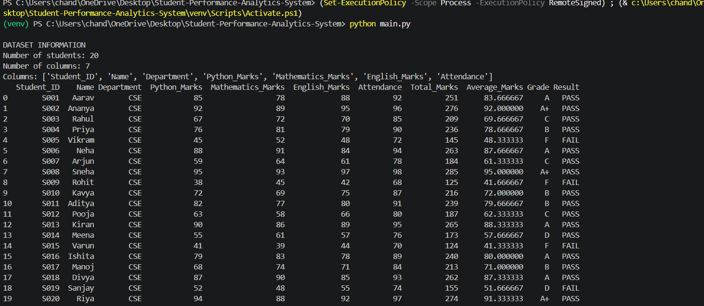
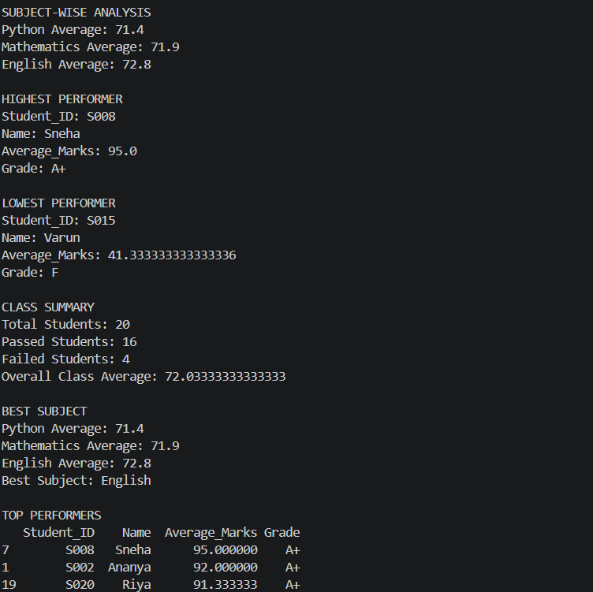

# Student Performance Analytics System

## 1. Project Title

*Student Performance Analytics System*

*Student:* Chandini Gupta
*Technology:* Python, NumPy, Pandas

---

## 2. Objective

The objective of this project is to build a Python-based Student Performance Analytics System that reads student data, processes the marks and attendance, and generates meaningful performance analysis.

The system calculates total marks, average marks, grades, pass/fail status, subject-wise performance, class performance, and identifies the highest, lowest, and top-performing students.

---

## 3. Technologies Used

- Python
- NumPy
- Pandas
- Visual Studio Code
- CSV Dataset

---

## 4. Dataset Description

The project uses a CSV dataset named student.csv.

The dataset contains *20 student records* and *7 original data columns*:

- Student_ID
- Name
- Department
- Python_Marks
- Mathematics_Marks
- English_Marks
- Attendance

The program processes this data and creates additional calculated fields such as:

- Total_Marks
- Average_Marks
- Grade
- Result

---

## 5. Implementation

### Step 1: Loading the Dataset

The student dataset is loaded using Pandas read_csv() and stored in a Pandas DataFrame.

### Step 2: Data Processing

The project processes the marks and attendance data for each student.

Reusable functions are used to calculate:

- Total marks
- Average marks
- Grade
- Pass/Fail result

### Step 3: NumPy Operations

NumPy is used for numerical calculations such as calculating averages using arrays and np.mean().

### Step 4: Grade Calculation

Grades are assigned according to the student's average marks.

### Step 5: Pass/Fail Calculation

A student is considered PASS when the average marks are at least 50 and attendance is at least 75%. Otherwise, the result is FAIL.

### Step 6: Performance Analysis

The system calculates subject-wise averages and identifies:

- Highest-performing student
- Lowest-performing student
- Overall class average
- Best-performing subject
- Top-performing students

---

## 6. Key Features

- Student dataset management
- Pandas DataFrame processing
- NumPy numerical calculations
- Reusable Python functions
- Loop-based processing
- Total marks calculation
- Average marks calculation
- Grade assignment
- Pass/Fail identification
- Subject-wise performance analysis
- Class performance summary
- Highest and lowest performer identification
- Top 3 performer identification

---

## 7. Output / Screenshots

The final program successfully displays:

- Dataset information
- Student performance records
- Subject-wise averages
- Highest performer
- Lowest performer
- Class summary
- Best subject
- Top performers

The following screenshots show the output generated by the Student Performance Analytics System.

### Output 1 – Student Dataset and Analysis

### Output 2 – Performance Summary

---

## 8. Final Outcome

The Student Performance Analytics System successfully processes student marks and attendance data and provides a clear summary of student and class performance.

The final analysis shows:

- *Total Students:* 20
- *Passed Students:* 16
- *Failed Students:* 4
- *Overall Class Average:* 72.03
- *Best Subject:* English
- *Highest Performer:* Sneha
- *Highest Average:* 95.0

The project demonstrates the use of Python, NumPy, Pandas, functions, loops, conditions, and data analysis concepts.

---

## 9. Challenges & Learning

### Challenges

During development, challenges included organizing the student dataset, calculating multiple performance metrics, and formatting the final output clearly.

### Learning

Through this project, I learned how to:

- Work with CSV datasets
- Create and process Pandas DataFrames
- Use NumPy for numerical calculations
- Create reusable Python functions
- Use loops and conditions
- Perform basic data analysis
- Generate meaningful results from student data
- Organize a Python project for GitHub submission

---

## 10. GitHub Repository

*GitHub Repository:* To be added after the project is uploaded to GitHub.

---

## Conclusion

The project successfully meets the requirements of the Student Performance Analytics System assignment by using Python, NumPy, and Pandas to analyze student performance data and generate meaningful results.